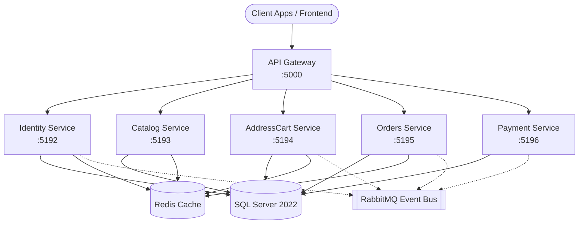

# FloweApp Backend

[](https://dotnet.microsoft.com/)
[]()

A microservices-based backend system for a flower delivery and e-commerce application. It provides functionalities for user authentication, catalog management, cart and address handling, order processing, and payment integration.

## Tech Stack

- **Core Framework**: .NET 8.0
- **Database Access**: Entity Framework Core 8.0
- **Database Engine**: Microsoft SQL Server 2022
- **API Gateway**: YARP (Yet Another Reverse Proxy) 2.3.0
- **Message Broker**: RabbitMQ (using MassTransit 8.5.4)
- **Caching**: Redis 7.0 (using StackExchange.Redis 2.7.27)
- **Object Mapping**: Mapster 10.0.11
- **Validation**: FluentValidation 12.1.1
- **Mediation**: MediatR 14.2.0
- **API Documentation**: Swagger/OpenAPI (Swashbuckle.AspNetCore 6.6.2)
- **Emails**: MailKit 4.17.0
- **Containerization**: Docker & Docker Compose

## Architecture Overview

The system is built as a set of domain-driven microservices hidden behind a YARP API Gateway. The gateway handles rate limiting and routing. Services communicate synchronously via HTTP (through the gateway or directly) and asynchronously via a RabbitMQ event bus for decoupled workflows.



## Prerequisites

- [.NET 8.0 SDK](https://dotnet.microsoft.com/download/dotnet/8.0)
- [Docker Desktop](https://www.docker.com/products/docker-desktop/) or Docker Engine with Docker Compose
- *Optional:* Visual Studio 2022, JetBrains Rider, or VS Code

## Getting Started / Installation

1. **Clone the repository**
   ```bash
   git clone <repository-url>
   cd floweapp-backend
   ```

2. **Setup Secrets**
   The Identity service requires Firebase credentials for push notifications/OTP. Ensure you place your service account file in the `secrets` directory:
   ```bash
   mkdir -p secrets
   # Place your firebase-service-account.json inside the secrets folder
   ```

3. **Configure Environment Variables**
   The project loads configuration from the `.env` file at the root. You can review and adjust variables like `Jwt__SecretKey` or `Stripe__SecretKey`. A comprehensive set of defaults are already provided for local development.

## Configuration

Configuration is heavily driven by the `.env` file at the root level which maps to .NET `IConfiguration` variables via the `DotNetEnv` package. No configuration logic is duplicated in `appsettings.json`.

<details>
<summary>View key environment variables</summary>

- `ASPNETCORE_ENVIRONMENT`: E.g., `Development`
- **Ports**:
  - `GATEWAY_HTTP_PORT=5000`
  - `IDENTITY_HTTP_PORT=5192`
  - `CATALOG_HTTP_PORT=5193`
  - `ADDRESSCART_HTTP_PORT=5194`
  - `ORDERS_HTTP_PORT=5195`
  - `PAYMENT_HTTP_PORT=5196`
- **Database**:
  - `SQL_SERVER=sqlserver` (Docker) or `localhost` (Local)
  - `MSSQL_SA_PASSWORD`: `<placeholder-password>`
  - Distinct connection strings (`ConnectionStrings__AuthDatabase`, etc.) exist for each service's DB.
- **Third Party Services**:
  - `Stripe__SecretKey`: Stripe API key
  - `Stripe__WebhookSecret`: Stripe Webhook signing secret
  - `Geocoding__ApiKey`: Google Maps Geocoding API key (Can use mock via `Geocoding__UseMockProvider=true`)
  - `Firebase__CredentialsPath`: Path to your firebase service account config
- **SMTP (Emails)**:
  - `Email__SmtpHost`, `Email__SmtpPort`, `Email__Username`, etc.
</details>

## Running the Project

### Using Docker Compose (Recommended)
To spin up the entire ecosystem including SQL Server, Redis, RabbitMQ, the API Gateway, and all Microservices:

```bash
docker-compose up -d --build
```
This maps the API Gateway to `http://localhost:5000` and ensures that services wait for the infrastructure health checks to pass before starting.

### Running Services Locally (Dev Mode)
If you prefer running a specific service via `dotnet cli`, first ensure your infrastructure (SQL Server, Redis, RabbitMQ) is running.

```bash
cd src/Services/IdentityService
dotnet run
```
*(Note: Be sure your database connection strings in `.env` point to `localhost` rather than `sqlserver` when running outside of Docker).*

## Project Structure

- `src/`
  - `ApiGateway/`: YARP-based entry point. Handles rate-limiting, CORS, and routing to backends.
  - `Services/`: Domain-driven microservices.
    - `IdentityService/`: Auth, user management, JWT issuance, OTP, and admin seeding.
    - `CatalogService/`: Products and categories management.
    - `AddressCartService/`: Shopping cart state and user address/geocoding operations.
    - `OrdersService/`: Order processing and lifecycle tracking.
    - `PaymentService/`: Stripe integration for checkout.
  - `Shared/`: Common models, middleware, auth setup, and utility classes shared across all services.
- `tests/`: Solution test projects.
  - `AddressCartService.Tests/`: Unit tests for `AddressCartService`.
- `secrets/`: Local directory (git-ignored content) holding sensitive files like Firebase configuration.

## Testing

The project uses `xUnit`, `Moq`, and `coverlet` for testing, backed by the EF Core InMemory database provider where applicable.

To run all tests in the solution:
```bash
dotnet test
```

To run tests with code coverage:
```bash
dotnet test --collect:"XPlat Code Coverage"
```

## API Documentation

When running in `Development` mode, each service exposes a Swagger UI for its endpoints. They can be accessed via the gateway or directly:
- **API Gateway**: `http://localhost:5000`
- **Swagger Endpoints (Direct)**:
  - Identity: `http://localhost:5192/swagger`
  - Catalog: `http://localhost:5193/swagger`
  - Address & Cart: `http://localhost:5194/swagger`
  - Orders: `http://localhost:5195/swagger`
  - Payment: `http://localhost:5196/swagger`

## Database Migrations

Entity Framework Core is used for schema management. Migrations are executed at the individual service level. To add or apply migrations, navigate to the specific service directory:

```bash
cd src/Services/CatalogService

# Add a new migration
dotnet ef migrations add InitialCreate

# Update the database
dotnet ef database update
```
*(Ensure your `.env` connection strings map to the correct local SQL instance before applying updates manually).*